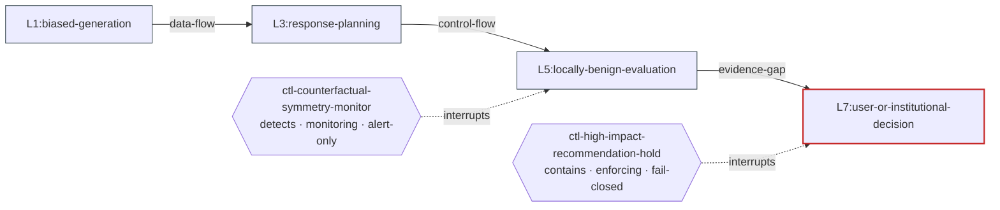

# MEAF — MAESTRO Executable Assurance Framework

MEAF is a machine-verifiable assurance layer over the Cloud Security Alliance
MAESTRO seven-layer agentic-AI threat taxonomy. A MEAF package links a declared
system boundary to components, threats, attack paths, control implementations,
assurance contracts, tests, evidence, findings and gate decisions in one JSON
artifact — so that when a deployed artifact changes, the claims that depended on
it stop being true, visibly and automatically.

It is the reference implementation of the appendix of *Security Considerations
for Long-Running Agentic AI Systems*.

> **What it does.** Evaluates whether claims about a declared boundary are
> internally consistent, backed by current evidence, and still bound to the
> artifacts on disk.
>
> **What it does not do.** Certify that an agent is safe. A package can be
> perfectly conformant and describe a system nobody should deploy.

| | |
|---|---|
| **Object model** | [docs/OBJECT-MODEL.md](docs/OBJECT-MODEL.md) — the nine object types, plus assurance contracts |
| **Conformance and the gate** | [docs/CONFORMANCE.md](docs/CONFORMANCE.md) — six levels, four contract states, three gate outcomes |
| **Security of the tool itself** | [docs/THREAT-MODEL-OF-MEAF.md](docs/THREAT-MODEL-OF-MEAF.md) — read before running it on a package you did not write |
| **Extending it** | [docs/DEVELOPER-GUIDE.md](docs/DEVELOPER-GUIDE.md) |
| **Upgrading from 1.0.0** | [docs/MIGRATION-1.0-TO-2.0.md](docs/MIGRATION-1.0-TO-2.0.md) |

---

## Quickstart

Python 3.10 or newer.

```bash
pip install -e .
NOW=2026-07-28T12:00:00Z   # pin the evaluation instant so results are reproducible

meaf validate meaf/examples/covert-influence.json --keyring meaf/examples/keyring.json --now $NOW
meaf gate     meaf/examples/covert-influence.json --now $NOW
meaf summary  meaf/examples/covert-influence.json --now $NOW
meaf report   meaf/examples/covert-influence.json --now $NOW --output report.md
meaf attest   meaf/examples/covert-influence.json
```

`python -m meaf ...` works identically if you would rather not install.

Three shipped packages exercise the three gate outcomes:

| Package | Gate | What it demonstrates |
|---|---|---|
| `covert-influence.json` | `allow` | The manuscript's worked covert-influence threat, fully covered |
| `memory-poisoning.json` | `review-required` | A cross-session memory-to-goal chain with one failing contract under a live, time-bounded exception |
| `broken.json` | `block` | A deliberate error at every one of the six conformance levels, so `validate` exits 1 and the gate blocks before any contract is evaluated |

---

## Concepts and object model

A MEAF package contains the **nine linked object types** of appendix A.2, plus
the **assurance contract** of A.3. Full field reference:
[docs/OBJECT-MODEL.md](docs/OBJECT-MODEL.md).

| # | Object | JSON member | Assurance purpose |
|---|---|---|---|
| 1 | System boundary | `system` | Defines exactly what the package covers |
| 2 | Component and AI bill of materials | `components` | Binds claims to deployed artifacts, exposes supply-chain dependencies |
| 3 | Threat | `threats` | Turns a narrative threat into a testable tuple with a temporal profile |
| 4 | Attack path | `attack-paths` | Makes cross-layer propagation and interruption points explicit |
| 5 | **Control implementation** | `control-implementations` | States **how and where** a threat is interrupted |
| 6 | Test | `tests` | Defines a reproducible challenge to a control claim |
| 7 | Evidence | `evidence` | Records attributable observations, never claims |
| 8 | Finding and remediation | `findings` | Carries failed assurance into tracked remediation |
| 9 | Decision and exception | `decisions` | Stops automated checks becoming unowned risk acceptance |
| + | **Assurance contract** | `assurance-contracts` | States **how we know** the interruption works |

### Control implementation versus assurance contract

This is the distinction everything else hangs on, and the one MEAF 1.0.0 got
wrong by collapsing both into `assurance-contracts`.

> Every control implementation is paired with an assurance contract. A control
> implementation describes how a threat is mitigated, while an assurance
> contract defines the evidence and tests required to verify that mitigation
> works. — appendix A.3

**A control implementation is the mechanism.** It answers: what does this thing
do, where does it run, what does it depend on, is it enforcing or just watching,
and what happens when it breaks?

```json
{
  "id": "ctl-high-impact-recommendation-hold",
  "function": "contain",
  "implementation-location": "L6:recommendation-gateway",
  "interruption-point": "L7:user-or-institutional-decision",
  "interruption-type": "contains",
  "enforcement-mode": "enforcing",
  "failure-behavior": "fail-closed",
  "dependencies": ["ctl-counterfactual-symmetry-monitor"],
  "owner": "role-incident-response-lead"
}
```

**An assurance contract is the proof.** It answers: what falsifiable claim, tested
how, against which thresholds, with what evidence, how fresh, how often, and who
is accountable when it fails?

```json
{
  "id": "ac-containment-001",
  "claim": "High-impact recommendations are held for independent review within four hours of a covert-influence indicator exceeding threshold.",
  "subject": "sys-research-agent",
  "control": "ctl-high-impact-recommendation-hold",
  "test": "test-containment-playbook-001",
  "decision-rule": { "containment-latency-seconds-max": 300 },
  "required-evidence": ["ev-containment-drill-2026-07"],
  "evidence-classes": ["deterministic-observation"],
  "evidence-max-age": "P90D",
  "cadence": "on-detect-failure-and-quarterly",
  "failure-action": "suspend-autonomous-operation",
  "owner": "role-incident-response-lead"
}
```

Three consequences, all enforced:

- **The control is what interrupts the path.** `interruption-point` and
  `interruption-type` live on the control, never on the contract. Note above
  that the control *runs* at L6 and *interrupts* at L7 — a real and useful
  distinction that a single field cannot express.
- **A control nobody verifies is a level 5 error.** The mitigation may work;
  nothing establishes that it does.
- **`failure-behavior` and `failure-action` are different questions.**
  `fail-closed` is what the gateway does when the gateway breaks.
  `suspend-autonomous-operation` is what the organisation does when the claim
  turns out to be false. An incident responder needs both, and only one of them
  existed in 1.0.0.

### Two design ideas

**Claims are separate from evidence.** A contract states a claim; evidence
records what was observed, by what method, against which artifact version, and
when. A control does not pass because an implementation statement exists.

**Assurance follows the deployed artifact.** Evidence binds to component digests.
Artifact binding is part of the freshness predicate, not a separate check:
evidence collected one minute ago against a superseded model, prompt, graph or
corpus snapshot is stale, however recent it is.

```bash
$ meaf impact meaf/examples/covert-influence.json --changed cmp-foundation-model --now $NOW
Evidence invalidated (3):
  ev-containment-drill-2026-07
  ev-counterfactual-run-2026-07
  ev-model-attestation

Contracts changing state (2):
  ac-epistemic-integrity-001: pass -> indeterminate
    - required evidence 'ev-counterfactual-run-2026-07': evidence is not bound to the deployed subject; missing digest(s): sha256:cccccccccccccccccccccccccccccccccccccccccccccccccccccccccccccccc
    - required evidence 'ev-counterfactual-run-2026-07': evidence was collected against artifact(s) that are no longer deployed: sha256:ae985607ebe5646f87c980036234a25e59a5f4b4ce878e166a0425c51347063b
  ac-containment-001: pass -> indeterminate
    - required evidence 'ev-containment-drill-2026-07': evidence is not bound to the deployed subject; missing digest(s): sha256:cccccccccccccccccccccccccccccccccccccccccccccccccccccccccccccccc
    - required evidence 'ev-containment-drill-2026-07': evidence was collected against artifact(s) that are no longer deployed: sha256:ae985607ebe5646f87c980036234a25e59a5f4b4ce878e166a0425c51347063b

Attack paths losing verified coverage: path-covert-influence-001
Gate: allow -> block
Recommended lifecycle state after the change: suspended
```

---

## The four contract states

An assurance contract is the smallest independently evaluable unit, and appendix
A.5 gives it exactly four states. Details and the evaluation order:
[docs/CONFORMANCE.md](docs/CONFORMANCE.md#contract-states).

| State | Meaning |
|---|---|
| `pass` | Every required test passes, all required evidence is current, and the artifact binding matches deployment |
| `fail` | At least one required test or deterministic policy predicate fails |
| `indeterminate` | Evidence is missing, stale, contradictory, probabilistic without an accepted decision rule, or collected outside the declared scope |
| `not-applicable` | A named authority has approved a documented rationale tied to the current system boundary |

> `indeterminate` **must not** be silently coerced to `pass`.

Nothing in this implementation returns `pass` without an affirmative reason, and
every state carries the reasons that produced it:

```bash
$ meaf gate meaf/examples/memory-poisoning.json --now $NOW
ac-memory-write-screening-001: fail (impact high)
  - required evidence 'ev-poison-write-probe-2026-05' reports result fail
ac-memory-recovery-001: pass (impact high)
  - 1 required evidence item(s) current, bound to the deployed subject, and passing
Contract states: 1 pass, 1 fail, 0 indeterminate, 0 not-applicable.

Gate decision under meaf-default:2.0.0: review-required
  - contract ac-memory-write-screening-001 is fail but role-risk-committee accepted it in dec-exception-memory-write-2026-06 until 2026-10-31
  - open finding finding-memory-write-screening-001 is covered by exception dec-exception-memory-write-2026-06
```

Exit codes: `0` allow, `1` block, `2` review-required.

---

## Policy is data, not code

Every organisational risk choice lives in a versioned **policy bundle**, not in
the validator. Two organisations can exchange the same package and reach
different gate results, and the difference is inspectable.

```jsonc
{
  "policy-id": "meaf-default",
  "permitted-digest-algorithms": ["sha256", "sha384", "sha512"],
  "approved-evidence-methods": [],
  "interruption-requirements": {
    "critical": {
      "require-before-outcome": ["blocks", "detects"],
      "require-recovery": ["contains", "restores"],
      "require-contract-pass": true    // a declared control is not enough
    }
    // ... high, medium, low
  },
  "indeterminate-handling": {
    "critical": "fail-closed",         // A.5 requires this choice to be explicit
    "high": "fail-closed",
    "medium": "require-review",
    "low": "require-review"
  },
  "maximum-exception-age-days": 180,
  "block-gate-on-open-finding-severity": ["critical", "high"],
  "require-authorization-decision": true,
  "probabilistic-evidence": { "permitted-for-gate": true, "require-decision-rule": true }
}
```

Copy [`meaf/policies/meaf-default-2.0.0.json`](meaf/policies/meaf-default-2.0.0.json),
edit it, pass it with `--policy`. See
[`meaf/examples/policy-strict.json`](meaf/examples/policy-strict.json) for a
tightened one — it bars probabilistic inference from gating, which turns the
reference package's detect contract indeterminate and blocks the gate. That
result is a policy choice, and the package says so.

---

## The conformance summary

Eight dimensions, and deliberately no aggregate score:

> MEAF intentionally does not define a universal aggregate security score. A
> single number conceals whether weak assurance comes from missing threats,
> uncovered paths, stale evidence, failed tests, or accepted residual risk.

```bash
$ meaf summary meaf/examples/memory-poisoning.json --now $NOW
Conformance summary for pkg-memory-to-goal-ops-assistant at 2026-07-28T12:00:00Z under meaf-default:2.0.0

Threat-model completeness       1/1 threats have contracts
Path-interruption coverage      1/1 paths meet their impact tier's requirements
Control-test status             1 pass, 1 fail, 0 indeterminate, 0 not-applicable
Evidence freshness              4/4 evidence items current
Open findings by severity       0 critical, 1 high, 0 medium, 0 low
Recovery readiness              1 verified, 0 unverified recovery contracts
Probabilistic dependence        0/2 gating contracts rely on inference
Exception age                   1 exception(s), 0 expired

No aggregate score is reported. A single number would conceal which of the
dimensions above is weak, which is the reason the framework refuses to define one.
  unresolved: ac-memory-write-screening-001 is fail
```

A test walks the whole summary structure and fails if any key looks like a
score. The pressure to put one on a dashboard is considerable; the reason for
refusing is good.

---

## Reports and diagrams are generated

> Human-readable views are generated from the structured source. Narrative
> reports, diagrams, and dashboards are projections of the assurance package
> rather than separately maintained artifacts that can drift from it.
> — appendix A.1, principle 6

`meaf report` emits Markdown with Mermaid diagrams, byte-deterministic for a
fixed package, policy and `--now`. Every attack path is drawn with the controls
that interrupt it at the node they interrupt:



The report also carries the assurance chain (threat → path → control → contract →
test → evidence, coloured by contract state), the lifecycle diagram with the
current state marked, the full threat model including the temporal profile, and
an unresolved-coverage section.

---

## Lifecycle

Six operational states plus terminal retirement. Every legal transition has a
registered guard, and a test asserts the guard table and the transition table
have identical keys — so a transition added later cannot inherit a permissive
default.

```bash
$ meaf lifecycle package.json --to authorized --actor role-assurance-review-board --now $NOW
Transition granted: assessed -> authorized (gate returns allow under meaf-default:2.0.0)
```

Moving **into** containment is never gated: a containment control that a stale
package can block is not a containment control. Moving **out** of containment
repeats the authorization guards, because A.8 step 6 requires new authorization
evidence before returning to service.

Full transition table with guards: [docs/CONFORMANCE.md](docs/CONFORMANCE.md#lifecycle).

---

## CLI reference

```
meaf {validate,gate,summary,report,run-tests,lifecycle,export-oscal,attest,impact,migrate,adoption,testpacks}
```

| Command | Purpose | Exit codes |
|---|---|---|
| `validate` | The six conformance levels | `0` clean, `1` errors |
| `gate` | Contract states and the deployment decision | `0` allow, `1` block, `2` review-required |
| `summary` | The eight A.5 summary dimensions | `0` |
| `report` | Markdown report with diagrams | `0` |
| `run-tests` | Execute runners, emit evidence | `0` when everything passed and nothing was left unrun |
| `lifecycle` | Inspect every guard, or attempt a transition | `0` granted, `1` refused |
| `export-oscal` | Seven OSCAL 1.1.2 documents | `0` |
| `attest` | Check or rebind artifact digests | `0` match, `1` drift or missing |
| `impact` | What a component change would invalidate | `0` |
| `migrate` | 1.0.0 to 2.0.0 | `0` complete, `1` decisions outstanding |
| `adoption` | Non-normative A.9 adoption level | `0` |
| `testpacks` | The nine standard test packs | `0` |

Shared flags: `--policy PATH` (default: the shipped bundle), `--now RFC3339`
(default: current time — pass it in CI), `--json` where a machine-readable form
exists, `--keyring PATH` for signature verification, `--root PATH` for
attestation.

---

## Writing a test runner

A runner writes one JSON object to stdout and exits `0`:

```json
{
  "result": "pass",
  "metrics": { "source-inclusion-asymmetry": 0.04, "paired-cases": 512 },
  "utility-metrics": { "contested-topic-answer-rate": 0.94 },
  "predicates": { "auto-contain-on-detect-failure": true },
  "model-metadata": { "evaluator-model": "...", "known-failure-modes": ["..."] },
  "diagnostics": "free text"
}
```

Anything else — non-zero exit, timeout, unparseable output, an unknown result
value — is `indeterminate`, with a diagnostic saying which. That is not a failure
of the system under test; it is the absence of an observation.

Decision rules understand `<metric>-max`, `<metric>-min`, `<metric>-exact`,
`minimum-<metric>` sampling adequacy, and boolean predicates. A key that matches
none of these is reported as unevaluable and drives the result to
`indeterminate` rather than being silently dropped.

An **adversarial** test must report benign-task utility alongside security. A
test that meets its security thresholds and misses its utility thresholds
reports `fail` — otherwise a model that refuses every contested topic scores as
perfectly unbiased.

> Runners are arbitrary commands named by the package. Run `run-tests` only on
> packages you trust. See
> [docs/THREAT-MODEL-OF-MEAF.md](docs/THREAT-MODEL-OF-MEAF.md).

---

## OSCAL interoperability

`meaf export-oscal` writes seven OSCAL 1.1.2 documents, following the A.4
mapping:

| MEAF content | OSCAL model |
|---|---|
| Control implementations, grouped by MAESTRO layer; contracts as assessment objectives | Catalog, Profile |
| Component capabilities and reusable implementations | Component Definition |
| System boundary, inventory, implementation statements, responsible roles | System Security Plan |
| Tests as activities; contract cadences as tasks | Assessment Plan |
| Evidence as observations, **threats as risks**, findings as findings | Assessment Results |
| Open findings and live exceptions | Plan of Action and Milestones |

MAESTRO semantics travel as namespaced properties: OSCAL property names are
tokens and cannot contain a colon, so `maestro:layer` is encoded as
`{"name": "layer", "ns": "https://cloudsecurityalliance.org/ns/maestro"}`.
Artifacts and evidence appear in back-matter as content-addressed resources, so
the package stays portable without embedding traces, corpora or model cards.

Exports are byte-deterministic: identifiers are UUIDv5 over the package id and a
collection-qualified object id, and `last-modified` comes from the newest
evidence timestamp rather than the wall clock.

---

## Standard test packs

The nine packs of appendix A.7 ship as a registry. A test may cite one, and the
validator checks that the citation resolves.

```bash
$ meaf testpacks
pack-model-provenance-and-latent-behavior  [adversarial]  layers: L1, L7
  Model provenance and latent behavior
    - signature and lineage verification
    - trigger search
    - targeted-behavior probes
    - fine-tuning persistence checks
    - supplier-change invalidation
pack-training-and-retrieval-data-integrity  [adversarial]  layers: L1, L2

... seven more packs ...
pack-recovery-readiness  [operational]  layers: L1, L2, L3, L4, L5, L6, L7
  Recovery readiness
    - known-good checkpoint validation
    - dependency-aware invalidation
    - memory and corpus reconstruction
    - credential rotation
    - replay
    - return-to-service criteria
```

---

## Adoption

The A.9 sequence, assessed by `meaf adoption`. It is explicitly non-normative:
it is guidance for rolling MEAF out, not a conformance level, and reaching
level 5 is not a claim that a system is secure.

1. **Structured** — boundary, inventory, threats, paths, controls and owners in a schema-valid package.
2. **Test-linked** — a contract and a reproducible test on every high-impact path; findings from failures.
3. **Evidence-bound** — evidence signed, bound to digests, freshness enforced, reports generated.
4. **Continuous** — change events invalidate dependent claims and invoke gates.
5. **Exchangeable** — independent reproduction, package exchange, supplier attestations.

> Success is not the production of a valid JSON document. Success is demonstrated
> when a real component change invalidates the correct evidence, automatically
> selects the relevant tests, blocks or degrades operation according to policy,
> produces an attributable decision record, and supports recovery to a verified
> state. — appendix A.9

The repository demonstrates exactly that sequence end to end; see
[docs/DEVELOPER-GUIDE.md](docs/DEVELOPER-GUIDE.md#8-the-pilot-end-to-end).

---

## Library use

```python
from datetime import datetime, timezone
from pathlib import Path

import meaf

now = datetime(2026, 7, 28, 12, tzinfo=timezone.utc)
package = meaf.load_package(Path("package.json"))
policy = meaf.default_policy()

findings = meaf.validate_package(package, now=now, policy=policy, root=Path("."))
if meaf.has_errors(findings):
    print(meaf.format_findings(findings))

gate = meaf.evaluate_gate(package, now=now, policy=policy)
print(gate.decision, gate.reasons)

for state in meaf.evaluate_contracts(package, now=now, policy=policy):
    print(state.contract_id, state.state, state.reasons)
```

The public surface is `meaf.__all__` and is tested for exact membership and
signature stability.

---

## Testing

```bash
pip install -r requirements-dev.txt
pytest --cov=meaf --cov-branch --cov-report=term-missing
```

The suite is under [`tests/`](tests/) with one module per unit under test. Beyond
unit coverage it asserts the properties that make the framework meaningful:
the object model matches the manuscript clause by clause; `indeterminate` is
never coerced at any layer; the guard table covers every legal transition; the
summary contains no aggregate score; exports and reports are deterministic; the
shipped examples are reproducible from a published demo seed; and the working
tree is unmodified after a full run.

CI additionally runs each claim this README makes about the shipped examples as
a command, so the documentation cannot drift from the behaviour.

---

## Stability and versioning

`meaf-version`, `meaf.__version__` and `meaf.SCHEMA_VERSION` move together. A
major bump is forced by: removing or renaming a `meaf.__all__` export or changing
its signature; changing a CLI subcommand, flag or exit code; a breaking schema
change; or changing `canonical_payload` bytes or the runner stdout contract.

2.0.0 is a breaking release: it separates control implementations from assurance
contracts and adds required fields. See
[docs/MIGRATION-1.0-TO-2.0.md](docs/MIGRATION-1.0-TO-2.0.md).

---

## Limitations and non-goals

- **No safety certification.** Conformance is about internal consistency,
  evidence currency and artifact binding.
- **No aggregate score.** By design.
- **JSON only.** The manuscript permits YAML and XML serializations; this
  implementation reads and writes JSON.
- **OSCAL shapes, not OSCAL validation.** Exports follow the OSCAL 1.1.2 JSON
  model and its required members, but the upstream schemas are not vendored, so
  the export is not validated against them here.
- **Runners are not sandboxed.** Environment scrubbing and timeouts are
  hardening, not isolation.
- **The demo signing key is published.** Evidence signed by it proves nothing.

---

## Provenance

This repository implements the appendix of the MAESTRO long-running-agent threat
analysis manuscript. Example packages describe a synthetic research assistant and
a synthetic operations assistant; the artifacts they bind are synthetic
demonstration files, and no claim is made about any real vendor, model or corpus.
