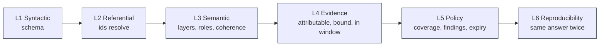
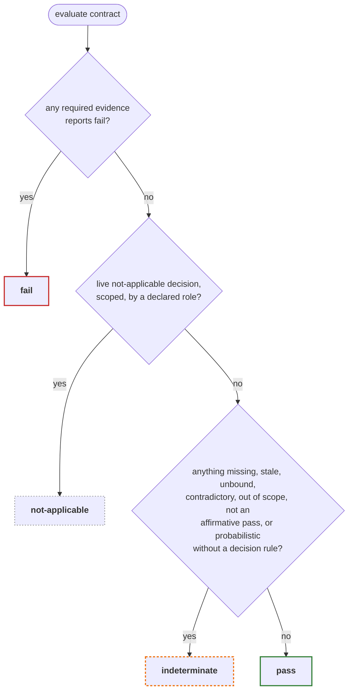
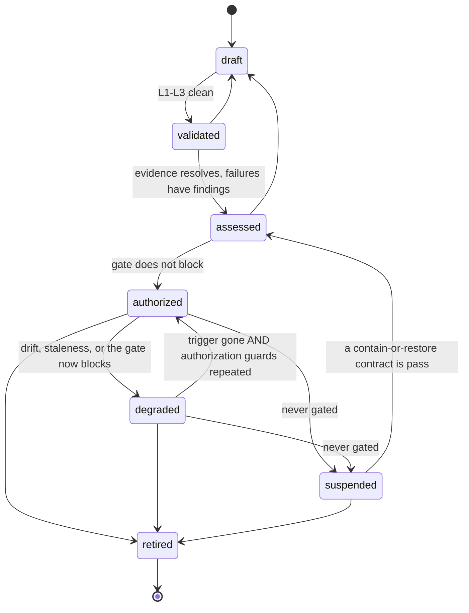

# Conformance, contract states, and the gate

> Machine-readable is not the same as machine-verifiable. — appendix A.5

This document covers what `python -m meaf validate` and `python -m meaf gate`
actually check, and why each check sits at the level it does.

---

## The six conformance levels

A conforming package passes six progressively stronger checks. Each level
assumes the ones below it, but **all six always run**: a package with a level 1
error still gets levels 2 through 6 evaluated, because a validator that stops at
the first malformed object hides the rest of the work from the person fixing it.

### L1 Syntactic validity

The serialization conforms to `meaf-2.0.0.schema.json`. Format keywords are
enforced with a checker, so `"collected-at": "not-a-date"` is an error rather
than a string that happens to be in a date field.

### L2 Referential integrity

Every reference resolves to **exactly one** object. Both halves matter: a
dangling `control` reference is an error, and so is a duplicated id, because a
reference to a duplicated id cannot resolve to exactly one object. Duplicates
are reported once, by the collection that holds them.

References checked: `provenance-evidence`, component `dependencies`, threat
`path`, control `attack-paths` and `dependencies`, contract `control`, `test`,
`threats`, `required-evidence` and `subject`, test `target`, finding
`failed-claim`, `retest-reference` and `affected-paths`, decision `applies-to`
and `compensating-controls`.

### L3 Semantic validity

| Check | Rationale |
|---|---|
| Attack-path nodes are valid MAESTRO labels | |
| `len(edges) == len(nodes) - 1` | An edge joins each adjacent pair; anything else is not a traversal |
| No consecutive duplicate nodes | |
| Digest algorithms are permitted by the policy bundle | A.5: "artifact digests use permitted algorithms" |
| Timestamps are coherent | Not in the future; `invalidated-at` not before `collected-at`; durations and dates parse |
| Owners and decision-makers resolve to declared roles | A.5: "required roles exist". An owner nobody declared cannot be held accountable for remediation |
| Control `function` and `interruption-type` are coherent | Stops a logging control counting as prevention |
| `interruption-point` is a node of every path the control claims to interrupt | Otherwise the control interrupts nothing |
| Contract `function` equals its control's `function` | |
| Contract `decision-rule` agrees with its test's `thresholds` on shared keys | Two thresholds for one metric is a silent disagreement about what passing means |
| Threat `target` resolves to a component, the system, or a declared data class | |
| A threat persisting beyond a session has a contract | Warning, not an error: A.5 puts "required threats have assurance contracts" at level 5, and reporting the same gap twice double-counts it |
| Exceptions have an owner and a usable expiry | A.5: "exceptions have owners and expiry dates" |
| Test packs resolve to the standard registry | Error if unknown; warning if uncited |
| Adversarial tests state evaluable utility thresholds | |

Layer numbers along a path are deliberately **not** required to ascend. The
manuscript's own cross-layer chains include L3→L2 (framework to data) and L5→L6
(observability to compliance), so a monotonic rule would reject the examples the
framework was written to describe.

### L4 Evidence validity

> evidence is signed or otherwise attributable, bound to the assessed artifact,
> collected by an approved method, within its validity window, and classified as
> deterministic observation or probabilistic inference

- **Attributable.** Without `--keyring`, one warning that verification was not
  performed — never a silent pass. With a keyring: unsigned evidence is reported
  as *unsigned*, which is a different problem from a signature that fails to
  verify. A signature whose `key-id` differs from the evidence's `collector` is
  an error even if it verifies, because otherwise one keyring holder could
  manufacture evidence attributed to every other collector.
- **Bound.** Every `subject-digest` must appear in the component inventory.
  Empty `subject-digests` is a warning: the evidence cannot be shown to be about
  any deployed artifact.
- **Approved method.** Checked against the policy bundle's
  `approved-evidence-methods`. An empty list emits one warning that no method
  policy is in force.
- **In window.** Reported as a warning here; the gate consequence arrives at
  level 5 through the contract state, so `validate` output distinguishes "this
  aged out" from "the claim it supports therefore failed".
- **Attested on disk.** With an attestation root: digest drift, a missing
  artifact file, and an `artifact-path` that escapes the root are all errors. A
  missing file is an error rather than a warning because declaring an
  `artifact-path` is a claim that the binding is checkable, and deleting the
  file must not be a cheaper way to pass than leaving it alone.

### L5 Policy validity

Driven by the policy bundle, not by hard-coded rules:

- every threat has a contract;
- every control implementation is paired with a contract;
- each attack path meets the interruption and recovery requirements of **its
  impact tier**. The default bundle requires the covering control's contract to
  be in state `pass`, not merely declared, on `critical` and `high` tiers, which
  is A.3's "at least one *currently verified* control before the harmful outcome
  and one *verified* containment or recovery mechanism". A failing contract
  under a live exception downgrades this to a warning naming the exception:
  A.3 also says exceptions must be "explicit, scoped, approved, and
  time-bounded", so an exception is the sanctioned way not to meet the
  requirement, not a way to hide it;
- a failing contract has a finding recording it;
- failing evidence has a finding referencing a contract that requires it;
- expired decisions are errors, and an exception running longer than the
  policy's ceiling is an error;
- an indeterminate contract on a fail-closed impact tier is an error, and a
  warning on tiers where the policy says review.

### L6 Reproducibility

> a second conforming evaluator using the same package, external evidence, and
> policy bundle reaches the same deterministic gate result

Each check names something that, left unpinned, makes the answer depend on the
evaluator's environment rather than the package: unversioned collectors,
unpinned `test-pack-version`, a runner invoking a shell (so the executed command
is not in the package), a contract gating on probabilistic inference without an
evaluable decision rule, and a declared `policy-bundle` that does not match the
bundle actually used.

`validate_package` takes `now` as a parameter for the same reason. Pass
`--now 2026-07-28T12:00:00Z` and two runs a week apart agree.

---

## Contract states

An assurance contract is in exactly one of four states.

The order is deliberate and fails closed at every step.

- **`fail` is evaluated first, ahead even of `not-applicable`.** A recorded
  failure is an observation, and no scoping decision can un-observe it.
  `not-applicable` means the claim does not apply to this system, which nobody
  can truthfully say about a claim whose test just failed against the deployed
  artifacts. The mechanism for carrying a failure a team cannot fix today is an
  **exception**: explicit, scoped, owned, time-bounded, and visible in the gate
  as `review-required` rather than silent.
- **`fail` also outranks staleness.** A failing observation that is also stale
  yields `fail`, because discarding it as "could not measure" is the more
  permissive reading.
- **`pass` requires an affirmative result from every required evidence item.**
  Anything that is neither `pass` nor `fail` — a missing `result`, an
  unrecognised value — is an absence of observation, not a success.
- **`indeterminate` is never coerced.** A.5 forbids it, and nothing in the
  implementation returns `pass` without an affirmative reason. Every state
  carries a `reasons` list explaining itself.
- **`not-applicable` requires a named authority.** A decision of type
  `not-applicable`, scoped to the contract via `applies-to`, unexpired, with an
  approving verdict, made by a role the package declares. Anything less is not
  an exemption.

### Evidence currency

A.5 gives the predicate as

    current(e, t) = (t - e.collected_at <= e.max_age) AND (e.invalidated_at is null)

and qualifies it immediately: evidence is current *"only when its subject digest
matches the deployed subject"*, and *"Artifact binding takes precedence over
calendar freshness. Evidence collected one minute ago against a superseded
prompt, adapter, model endpoint, graph, policy, or retrieval snapshot is
stale."*

Artifact binding is therefore a **conjunct of currency**, not a separate check,
and it has two halves:

1. **The evidence must cover the claimed subject.** A contract whose subject is
   a component requires evidence bound to that component's current digest; a
   contract whose subject is the system requires evidence bound to every
   component digest, because a system-level assertion made before a component
   changed is an assertion about a system that no longer exists.
2. **Nothing the evidence was collected against may have been superseded.**
   A.5's list — "a superseded prompt, adapter, model endpoint, graph, policy, or
   retrieval snapshot" — is not limited to the claim's subject. An evaluation
   run against a still-current model but a replaced retrieval corpus observed a
   system that no longer exists, and swapping an LLM judge's own prompt
   invalidates the judgments made with it.

Both are computed in `meaf.model.evidence_currency`, and the reasons list keeps
them apart so an operator can see which one fired.

A contract may tighten freshness beyond what an evidence item declares for
itself, via `evidence-max-age`. The stricter of the two always wins.

---

## The gate

`python -m meaf gate` maps contract states to a deployment decision under the
policy bundle. Exit codes: `0` allow, `1` block, `2` review-required.

| Condition | Effect |
|---|---|
| A contract is `fail` | **block** |
| A contract is `fail` under a live `exception` | **review-required** — a named authority accepted it, bounded by an expiry. The claim is still false |
| A contract is `indeterminate` | Whatever `indeterminate-handling` says for that path's impact tier: `fail-closed` → block, `require-review` → review, `permit` → allowed. A.5 requires this choice to be explicit |
| An open finding has a blocking severity | **block**, unless a live exception covers its contract |
| No live authorization decision, and the policy requires one | **block** |
| Probabilistic inference gates more than the policy's ceiling share of contracts | **review-required** |

The three shipped examples exercise all three outcomes:
`covert-influence.json` allows, `memory-poisoning.json` reviews, and
`memory-poisoning.json` with its exception removed blocks.

---

## The conformance summary

`python -m meaf summary` reports the eight dimensions A.5 names, and **no
aggregate score**:

> MEAF intentionally does not define a universal aggregate security score. A
> single number conceals whether weak assurance comes from missing threats,
> uncovered paths, stale evidence, failed tests, or accepted residual risk.

The dimensions are threat-model completeness, path-interruption coverage,
control-test status, evidence freshness, open findings by severity, recovery
readiness, probabilistic-evidence dependence, and exception age. A test walks the
whole summary structure and fails if any key looks like a score, because the
pressure to put one on a dashboard is considerable and the reason for refusing is
good.

---

## Lifecycle

Six operational states plus terminal retirement (A.8). Every legal transition
has a registered guard; a test asserts the guard table and the transition table
have identical keys, so a transition added later cannot inherit a permissive
default.

Recovery is deliberately asymmetric. Moving **into** containment is never gated:
a containment control that a stale package can block is not a containment
control. Moving **out** of containment repeats the authorization guards, because
A.8 step 6 requires "new authorization evidence before returning to service".

A transition's `actor` must be a declared responsible role. A state change
attributable to nobody is not a policy decision.
