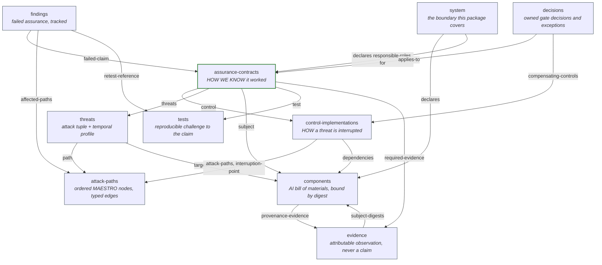

# The MEAF object model

A MEAF package contains the **nine linked object types** of manuscript appendix
A.2, plus the **assurance contract** of A.3. Stable identifiers make the
relationships executable: a validator can reject dangling references, stale
results, and uncovered attack paths without reading a word of prose.

This document is the normative reference for what each object means. The JSON
Schema at [`meaf/schema/meaf-2.0.0.schema.json`](../meaf/schema/meaf-2.0.0.schema.json)
is the machine-readable form of the same thing, and
[`tests/test_object_model.py`](../tests/test_object_model.py) asserts that the
two agree with the manuscript.

---

## The one distinction that matters

> Every control implementation is paired with an assurance contract. A control
> implementation describes how a threat is mitigated, while an assurance
> contract defines the evidence and tests required to verify that mitigation
> works. — appendix A.3

|  | Control implementation | Assurance contract |
|---|---|---|
| Answers | *How is this threat interrupted?* | *How do we know it worked?* |
| Object type | One of the nine (A.2) | Introduced in A.3, paired with a control |
| Owns | The mechanism | The proof |
| Carries | function, implementation location, dependencies, enforcement mode, failure behaviour, the attack paths it interrupts, the node it interrupts, the interruption type | claim, subject, the control it verifies, threats, function, test, decision rule, required evidence, acceptable evidence classes, freshness, cadence, failure action, owner |
| Fails how | `failure-behavior`: what the control does when the control itself breaks — `fail-closed`, `fail-open`, `degrade`, `alert-only` | `failure-action`: what the assurance system does when the claim is falsified — `alert`, `degrade-privileges`, `block-deployment`, `suspend-autonomous-operation`, `quarantine-memory`, `invoke-recovery` |
| Without the other | An assertion nobody has agreed to check | A claim about a mitigation that does not exist |

Two consequences follow, and both are enforced:

- A control implementation that no contract references is a level 5 policy
  error. The mitigation may well work; nothing establishes that it does.
- `interruption-point` and `interruption-type` live on the **control**, never on
  the contract. Controls are what interrupt attack paths; contracts are what
  verify them. In MEAF 1.0.0 both objects were collapsed into
  `assurance-contracts`, which is precisely why the two concepts read as
  interchangeable.

The abridged reference serialization in appendix A.6 predates the split and puts
`interruption-point` on the contract. A.3's prose is the governing text: *"Controls
are mapped to attack paths through typed interruption points"*, and the AC tuple
it defines — `AC = (claim, subject, threats, function, test, threshold, evidence,
cadence, failure_action, owner)` — contains no interruption point at all.

---

## The whole model

Green is the assurance contract, the tenth object and the smallest
independently evaluable unit. Everything else is one of the nine.

---

## Object reference

### 1. `system` — system boundary

Defines exactly what the package covers. A claim is only as scoped as the
boundary it is made inside.

| Field | Meaning |
|---|---|
| `id` | Identifier the contracts refer to when the subject is the whole system |
| `owner` | Role accountable for the system, resolved against `responsible-roles` |
| `deployment`, `environment` | Where it runs |
| `data-classes` | What it processes; a threat may target one of these by name |
| `users` | Who uses it |
| `trust-boundaries` | Where trust changes hands |
| `critical-outcomes` | What must not be lost |
| `responsible-roles` | Every `owner` and `decision-maker` in the package must resolve to one of these. A.5 level 3 requires that "required roles exist" |

### 2. `components` — component and AI bill of materials

Binds claims to deployed artifacts and exposes supply-chain dependencies.

| Field | Meaning |
|---|---|
| `type` | `foundation-model-service`, `retrieval-collection`, `adapter`, `prompt`, `agent-graph`, `tool`, `dataset`, `policy`, `memory-store`, `guardian-agent` |
| `artifact-id` | Weight, endpoint or snapshot identifier |
| `provider` | Supplying party. Use your own organisation for anything built in-house |
| `digest` | `sha256:` / `sha384:` / `sha512:` over the artifact bytes |
| `artifact-path` | Optional path, resolved **relative to the package file** and refused if it escapes that directory |
| `dependencies` | Other component ids |
| `provenance-evidence` | Evidence id establishing where the artifact came from |

### 3. `threats` — threat

Converts a narrative threat into a testable tuple:

    T = (actor, capability, stage, preconditions, entry, path, objective,
         target, outcome, temporal_profile)

`capabilities`, `attack-classes` and `objective` should use stable external
identifiers where they exist — for instance NIST AI 100-2 E2025 gives
`NISTAML:model-control` for a capability, `NISTAML.015` for indirect prompt
injection, and `NISTAML.02` for an integrity-violation objective.

The **temporal profile** is what makes long-running risk explicit rather than
burying it in prose. Every field is enumerated or quantified, because a value
like `"multi-session"` cannot be compared across two packages:

| Field | Values |
|---|---|
| `persistence` | `session`, `cross-session`, `model-version`, `agent-identity`, `ecosystem` |
| `activation-latency` | An ISO 8601 duration, or `immediate`, `trigger-conditional`, `unbounded`, `unknown` |
| `exposure-unit` | `turn`, `retrieval`, `memory-write`, `tool-call`, `delegation`, `task`, `wall-clock-interval` |
| `compounding-rule` | `none`, `cumulative`, `thresholded`, `feedback-driven`, `specified-function` |
| `dormancy` | `none`, `trigger-conditional`, `condition-conditional`, `unknown`; the conditional values require `dormancy-trigger` |
| `detection-horizon` | `{minimum-observations, observation-period}` — at least one. If your detector needs 500 paired cases over 30 days, a 7-day monitoring window cannot see this threat, and the package now says so |
| `reversibility` | `automatic`, `checkpoint-dependent`, `reconstruction-dependent`, `model-replacement`, `unknown` |
| `recovery-objective` | `{max-containment-time, max-acceptable-loss}` — two quantities, not one sentence |

A threat whose `persistence` is anything other than `session` must be referenced
by at least one assurance contract (level 3).

### 4. `attack-paths` — attack path

Ordered MAESTRO nodes and typed edges, making cross-layer propagation and
interruption points explicit.

- `nodes`: `L1:`…`L7:` labels, at least two. Layer numbers are **not** required
  to ascend; the manuscript's own chains include L3→L2 and L5→L6 traversals.
- `edges`: one per traversal step, so exactly `len(nodes) - 1` of them, drawn
  from `data-flow`, `control-flow`, `trust-flow`, `privilege-flow`,
  `memory-flow`, `evidence-gap`.
- `impact`: `critical`, `high`, `medium`, `low`. The policy bundle keys its
  interruption requirements off this, which is how A.5's "high-impact paths"
  clause becomes evaluable rather than applied uniformly.

### 5. `control-implementations` — control implementation

States how and where a threat is interrupted.

| Field | Meaning |
|---|---|
| `function` | `prevent`, `detect`, `contain`, `recover` |
| `owner` | Role accountable for the mechanism |
| `implementation-location` | MAESTRO node where the control **runs** |
| `interruption-point` | MAESTRO node on the path it **interrupts**. May differ: a policy engine at L6 can interrupt a decision at L7 |
| `interruption-type` | `blocks`, `detects`, `limits`, `contains`, `restores`, `supports-investigation` |
| `attack-paths` | Paths it interrupts; `interruption-point` must be a node of each |
| `dependencies` | Components or other controls it needs. An empty array asserts none |
| `enforcement-mode` | `enforcing`, `monitoring`, `advisory` |
| `failure-behavior` | `fail-closed`, `fail-open`, `degrade`, `alert-only` |

Function and interruption type must be coherent, which is what stops "a logging
control from being counted as prevention or a detector from being credited as
containment":

| `function` | Permitted `interruption-type` |
|---|---|
| `prevent` | `blocks`, `limits` |
| `detect` | `detects`, `supports-investigation` |
| `contain` | `contains`, `limits` |
| `recover` | `restores` |

### 6. `assurance-contracts` — assurance contract

The smallest independently evaluable unit.

    AC = (claim, subject, threats, function, test, threshold, evidence,
          cadence, failure_action, owner)

| Field | Meaning |
|---|---|
| `claim` | A **falsifiable** statement, for example "only signed model artifacts may be loaded" |
| `subject` | The exact artifact or runtime boundary: a component id, or the system id |
| `control` | The control implementation this contract verifies |
| `function` | Must equal the control's function |
| `test` | The reproducible challenge |
| `decision-rule` | The thresholds — the `threshold` element of the tuple |
| `required-evidence`, `evidence-classes`, `evidence-max-age` | The `evidence` element: which observations, of what class, how fresh |
| `cadence` | Event-driven and time-driven reassessment |
| `failure-action` | What the assurance system does when the claim is falsified |
| `owner` | Who is accountable for remediation |

Contract state is one of four ([conformance](CONFORMANCE.md#contract-states)):
`pass`, `fail`, `indeterminate`, `not-applicable`.

### 7. `tests` — test

A reproducible challenge to a control claim: `procedure`, `target`, `inputs`,
`oracle`, `metrics`, `thresholds`, `sampling-plan`, `expected-result`,
`test-pack-version`.

An **adversarial** test must additionally state `utility-metrics` and
`utility-thresholds`. A.7: "A control that prevents all influence by refusing
every contested topic, or prevents all tool abuse by disabling every tool, has
not demonstrated acceptable resilient performance." A test that meets its
security thresholds and misses its utility thresholds reports `fail`.

`test-pack` optionally cites one of the [nine standard packs](../meaf/testpacks/registry-2.0.0.json);
`python -m meaf testpacks` lists them. A test with a `runner` must declare
`evidence-class`, so an LLM-judged result cannot be emitted as a deterministic
observation.

### 8. `evidence` — evidence

Records attributable observations **without conflating them with claims**.

| Field | Meaning |
|---|---|
| `class` | `deterministic-observation` or `probabilistic-inference` |
| `subject-digests` | The artifacts this observation was made against |
| `source` | The system of record it came from |
| `method`, `collector` | How, and by what versioned tool |
| `collected-at`, `max-age`, `invalidated-at` | The validity window |
| `result` | `pass`, `fail`, `indeterminate` |
| `signature` | Detached Ed25519, whose `key-id` must equal the `collector` |
| `model-metadata` | Required for, and only for, probabilistic inference |

`model-metadata` carries every field A.5 requires of an LLM judgment that
contributes to a gate: `evaluator-model`, `evaluator-prompt-digest`,
`threshold`, `calibration-set`, `uncertainty`, `known-failure-modes`,
`escalation-path`.

### 9. `findings` — finding and remediation

Carries failed assurance into tracked remediation: `failed-claim`, `severity`
(`critical`/`high`/`medium`/`low`, so the summary can aggregate it),
`affected-paths`, `root-cause`, `corrective-action`, `due-date`,
`retest-reference`, and an optional `status`.

### 10. `decisions` — decision and exception

Prevents automated checks from becoming unowned risk acceptance.

| `decision-type` | Effect |
|---|---|
| `authorization` | Gates the package. The default policy requires a live one before the gate can allow |
| `exception` | Time-bounded acceptance of a known failure. Downgrades a `fail` from *block* to *review-required*; it never makes the claim true |
| `not-applicable` | Declares a contract out of scope. This, and only this, produces the `not-applicable` contract state |

`exception` and `not-applicable` must name what they scope via `applies-to`, must
be made by a declared responsible role, and must expire. The policy bundle caps
how long an exception may run.

---

## Two deliberate narrowings

Both tighten the manuscript rather than contradicting it, and both are stated
here because a profile that silently narrows its own specification is worse than
one that does not narrow at all.

**Enumerated temporal profiles.** A.2 describes the temporal fields in prose and
its own abridged example uses free text (`"persistence":
"model-version-or-corpus-snapshot"`, `"detection-horizon": "multi-session"`).
MEAF 2.0.0 enumerates the fields the manuscript enumerates and quantifies the
two it describes as quantities. The cost is that a 1.0.0 value may have no exact
2.0.0 equivalent, and `meaf migrate` reports each one rather than guessing. The
gain is that two packages become comparable: "multi-session" cannot be checked
against a detector's actual observation window, and
`{minimum-observations: 500, observation-period: P30D}` can.

**A contract subject must resolve to a digest.** A.3 says `subject` "identifies
the exact artifact or runtime boundary". MEAF accepts a component id or the
system id, and nothing else. A runtime boundary named only in prose cannot be
bound to a deployed digest, and A.5 makes artifact binding a conjunct of
evidence currency — so a subject that resolves to nothing makes the currency
predicate unanswerable. If you need to make a claim about a boundary narrower
than the system, declare it as a component.

---

## What is not an object

**The policy bundle** is a separate versioned artifact, referenced by
`policy-bundle` and passed with `--policy`. It holds every organisational risk
choice: permitted digest algorithms, approved evidence-collection methods,
interruption requirements per impact tier, what the gate does with an
indeterminate contract, the maximum exception age. Keeping it out of the package
is what lets two organisations exchange the same package and reach different —
but explicable — gate results.

**The lifecycle** is package state, not an assurance object. See
[CONFORMANCE.md](CONFORMANCE.md#lifecycle).

**Reports and diagrams** are projections. They are generated by
`python -m meaf report` and never maintained by hand, because a hand-maintained
report can describe coverage the package does not have.
