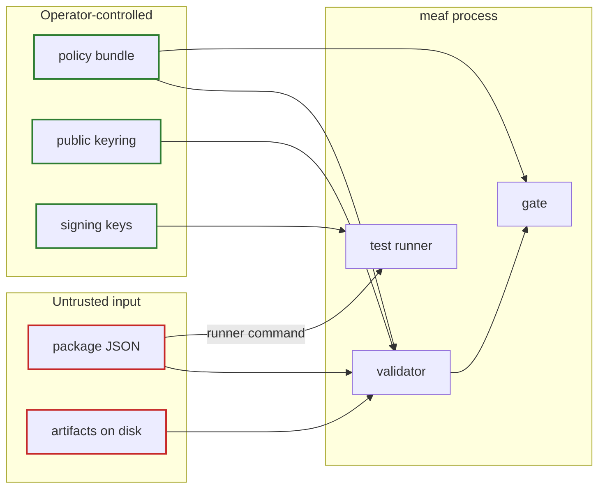

# Threat model of the assurance system itself

> The assurance system is itself a high-value attack surface. Packages,
> validators, policy bundles, evidence collectors, and signing keys require
> separation of duties, least privilege, reproducible builds, version pinning,
> tamper-evident storage, and independent monitoring. — appendix A.9

An attacker who cannot compromise your agent may find it easier to compromise
the thing that says your agent is fine. This document states what this
implementation defends against, what it does not, and what you have to do
yourself. Read it before you run `meaf` on a package you did not write.

---

## Trust boundaries

**A package is untrusted input.** Treat it the way you would treat a document
uploaded by a stranger. **The policy bundle and the keyring are not**: they carry
your organisation's risk decisions and your trust anchors, and they must come
from a path you control, not from the package.

---

## What this implementation defends against

| Attack | Defence |
|---|---|
| Forged evidence | Detached Ed25519 signatures, verified with `--keyring`. Without a keyring, one explicit warning — never a silent pass |
| One collector signing as another | `signature.key-id` must equal `evidence.collector`. Otherwise a single compromised tool could manufacture evidence attributed to every other tool |
| Evidence about a different artifact | Artifact binding is a conjunct of currency. Evidence collected one minute ago against a superseded digest is not current |
| Silently swapping a bound artifact | `attest` recomputes digests from disk; drift is a level 4 error and moves an authorized package to `degraded` |
| Deleting a bound artifact to dodge the drift check | A missing artifact file is an **error**, not a warning. Declaring an `artifact-path` is a claim that the binding is checkable |
| `artifact-path` as a file-read primitive | Paths are resolved relative to the package file and refused if absolute or if they escape that directory |
| Re-binding stale evidence to a new artifact | `attest --update` rewrites component digests and **never** evidence `subject-digests`. It reports which evidence has become unbound instead |
| A denied authorization read as an approval | `gate-decision` is a closed vocabulary matched exactly. A substring test once accepted `"disapproved"` as approval |
| "Could not measure" presented as "passed" | `indeterminate` is never coerced, at any layer: runner, contract state, gate, or lifecycle guard |
| An unowned exception | Exceptions require a declared responsible role, an `applies-to` scope, and an expiry, and the policy bundle caps how long one may run |
| A tautological defence | Adversarial tests must state benign-task utility thresholds; meeting security while missing utility reports `fail` |
| An LLM judgment laundered into telemetry | Probabilistic evidence must carry evaluator model and prompt digest, calibration set, threshold, uncertainty, known failure modes, and an escalation path. A deterministic observation may not carry model metadata at all |
| Evaluator drift between two parties | `now` is injectable, exports are deterministic, and level 6 errors on unversioned collectors and unpinned test packs, and warns when a runner invokes a shell |

## What it does not defend against

**Test runners execute arbitrary commands from the package.** `run-tests` runs
the `runner.command` a package author wrote. The environment is reduced to a
minimal allow-list so a runner cannot pick up ambient credentials from your
shell, and the command is captured with a timeout — but that is hardening, not a
sandbox. There is no filesystem, network or syscall isolation.

> Run `meaf validate`, `gate`, `summary`, `report` and `attest` on any package.
> Run `meaf run-tests` only on packages you trust, on a host you are willing to
> give that trust.

In CI, run `run-tests` in the same isolation you would give any other build
step, and never on a package that arrives from a fork.

**The demo signing key is published.** `meaf/examples/tools/regenerate.py`
derives the example key from a seed printed in its own source, so anyone can
reproduce the shipped signatures. That is the point: it makes the examples
verifiable. It also means evidence signed by that key proves nothing. Never put
it in a production keyring.

**MEAF does not certify safety.** It evaluates whether claims about a declared
boundary are internally consistent, backed by current evidence, and still bound
to the artifacts on disk. A package can be perfectly conformant and describe a
system nobody should deploy.

---

## Operating the assurance system

**Separation of duties.** The party that authors a package should not be the
party that signs evidence for it, and neither should be the party that holds the
authorization role. The schema makes this visible — `owner`, `decision-maker` and
`collector` are distinct fields — but it cannot enforce it. Your role assignment
does.

**Key handling.** Signing keys belong in an HSM or a managed KMS, not in a repo.
`.gitignore` excludes `*.pem` and `*.key`, which is a backstop, not a strategy.
The keyring you validate against should be distributed through a channel
independent of the packages it verifies.

**Version pinning and reproducible builds.** Level 6 checks the package's side of
this: collectors, test packs and runners must be pinned. The other side is yours
— pin `meaf` itself, pin the policy bundle, and record which versions produced an
authorization decision.

**Tamper-evident storage.** MEAF records lifecycle transitions with actor and
reason, but the package file is only as tamper-evident as where you keep it.
Store authorized packages in append-only storage, and treat a package whose
history has been rewritten as unauthorized.

**Independent monitoring.** The gate is only meaningful if something notices
when it changes. Run `meaf gate` on a schedule with a pinned `--now`, and alert
on any transition away from `allow`. `meaf impact --changed <component>` answers
the same question before a change lands rather than after.

**An LLM may propose; it may not attest.** A.9: "An LLM may assist with authoring
mappings or summarizing findings, but its output remains an untrusted proposal
until validated and approved. It must not create or alter deterministic
evidence." Nothing in the tool can enforce that. It is a rule about who may hold
a signing key.

---

## Reporting a vulnerability

Open a security advisory on the repository rather than a public issue. Include
the package or policy bundle that reproduces the problem; if it contains
anything sensitive, send digests and the structure rather than the content —
which is the same discipline the framework asks of evidence.
